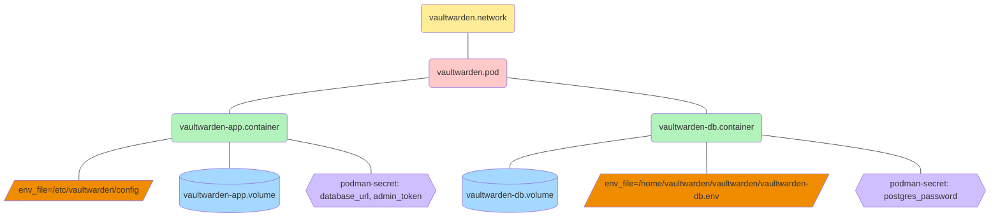

# 4.使用 Podman


对应的[官方页面地址](https://github.com/dani-garcia/vaultwarden/wiki/Using-Podman)


[Podman](https://podman.io/) 是替代 Docker 的无守护程序，它与大部分 Docker 容器兼容。

## 创建 Quadlet（适用于 Podman 4.4+） <a href="#creating-a-quadlet-podman-4.4" id="creating-a-quadlet-podman-4.4"></a>

从版本 4.4 开始，Podman 使用 [quadlets](https://docs.podman.io/en/latest/markdown/podman-systemd.unit.5.html)，如果您使用以前的 `generate systemd` 方法，则会显示一个警告。

额外的好处是此方法将使容器保持更新。

### 通过环境文件配置 <a href="#configuration-via-environment-file" id="configuration-via-environment-file"></a>

在环境文件中进行配置可能会更容易并且不易出错。

注意：此文件包含机密，请确保只有 root 拥有访问权限！

```sh
sudo install -o0 -g0 -m600 /dev/null /etc/vaultwarden.env
sudo vi /etc/vaultwarden.env
```

```sh
# Contents of /etc/vaultwarden.env
ROCKET_PORT=8080

# DISABLE_ADMIN_TOKEN=true
# ADMIN_TOKEN=$argon2id$...

# LOG_LEVEL=debug
```

### 创建 podman Quadlet <a href="#creating-the-podman-quadlet" id="creating-the-podman-quadlet"></a>

配置看起来像 systemd 的，但我们配置的是容器，而不是单元。请参阅所有 `[Container]` 指令的[文档](https://man.archlinux.org/man/quadlet.5.en#Container_units_%5BContainer%5D)。

```systemd
# Content of /usr/share/containers/systemd/vaultwarden.container
[Unit]
Description=Vaultwarden container
After=network-online.target

[Container]
AutoUpdate=registry
Image=ghcr.io/dani-garcia/vaultwarden:latest
Exec=/start.sh
EnvironmentFile=/etc/vaultwarden.env
Volume=/vw-data/:/data/
PublishPort=8080:8080

[Install]
WantedBy=default.target
```

编辑 quadlet 后，运行 `systemctl daemon-reload` 以创建或更新 systemd 单元。您可以使用常规的 `systemctl` 命令控制此容器，例如 `systemctl start vaultwarden.service` 。

### 自动更新 <a href="#auto-update" id="auto-update"></a>

[自动更新](https://docs.podman.io/en/latest/markdown/podman-auto-update.1.html#description)可自动执行更新过程：

```sh
sudo podman auto-update
```

或者，您可以启用定时器，它会每天自动更新（默认情况。也可以编辑）：

```sh
sudo systemctl enable podman-auto-update.timer
```

## 创建 systemd 服务文件（适用于老版本的 Podman） <a href="#creating-a-systemd-service-file-older-podman-versions" id="creating-a-systemd-service-file-older-podman-versions"></a>

由于 Podman 的无守护程序架构，它比 Docker 更容易在 systemd 中运行。它带有一个便捷的 [generate syetemd 命令](http://docs.podman.io/en/latest/markdown/podman-generate-systemd.1.html)，该命令可以生成 systemd 文件。[这一篇不错的文章详细介绍了它](https://www.redhat.com/zh/blog/podman-shareable-systemd-services)，还有[这篇文章也详细介绍了一些最新的更新](https://www.redhat.com/zh/blog/improved-systemd-podman)。

```systemd
$ podman run -d --name vaultwarden -v /vw-data/:/data/:Z -e ROCKET_PORT=8080 -p 8080:8080 vaultwarden/server:latest
54502f309f3092d32b4c496ef3d099b270b2af7b5464e7cb4887bc16a4d38597
$ podman generate systemd --name vaultwarden
# container-foo.service
# autogenerated by Podman 1.6.2
# Tue Nov 19 15:49:15 CET 2019

[Unit]
Description=Podman container-foo.service
Documentation=man:podman-generate-systemd(1)

[Service]
Restart=on-failure
ExecStart=/usr/bin/podman start vaultwarden
ExecStop=/usr/bin/podman stop -t 10 vaultwarden
KillMode=none
Type=forking
PIDFile=/run/user/1000/overlay-containers/54502f309f3092d32b4c496ef3d099b270b2af7b5464e7cb4887bc16a4d38597/userdata/conmon.pid

[Install]
WantedBy=multi-user.target default.target
```

您可以提供 `--files` 标志告诉 podman 将 systemd 服务放到某个文件中，或使用 `podman generate systemd --name vaultwarden > /etc/systemd/system/container-vaultwarden.service`。这样，我们就可以像任何正常的服务文件一样启用和启动容器了。

```shell
$ systemctl --user enable /etc/systemd/system/container-vaultwarden.service
$ systemctl --user start container-vaultwarden.service
```

### 每次重启时新建容器 <a href="#new-container-every-restart" id="new-container-every-restart"></a>

如果我们希望每次服务启动时都创建一个新的容器，可以使用 `podman generate systemd --new` 命令生成一个重新创建容器的服务文件：

```shell
$ podman generate systemd --new --name vaultwarden
```

如果您使用的是旧版 Podman，则可以编辑服务文件以包含如下内容：

```systemd
[Unit]
Description=Podman container-vaultwarden.service

[Service]
Restart=on-failure
ExecStartPre=/usr/bin/rm -f /%t/%n-pid /%t/%n-cid
ExecStart=/usr/bin/podman run --conmon-pidfile /%t/%n-pid --cidfile /%t/%n-cid --env-file=/home/spytec/Vaultwarden/vaultwarden.conf -d -p 8080:8080 -v /home/spytec/Vaultwarden/vw-data:/data/:Z vaultwarden/server:latest
ExecStop=/usr/bin/podman stop -t "15" --cidfile /%t/%n-cid
ExecStop=/usr/bin/podman rm -f --cidfile /%t/%n-cid
KillMode=none
Type=forking
PIDFile=/%t/%n-pid

[Install]
WantedBy=multi-user.target default.target
```

环境文件 `vaultwarden.conf` 可以包含您需要的容器的所有环境值，比如：

```systemd
ROCKET_PORT=8080
```

如果您希望此容器拥有特定的名称，则需要添加 `ExecStartPre=/usr/bin/podman rm -i -f vaultwarden`，如果进程未被正确清理的话。注意，此方式当前无法与具有 `User=` 选项的用户一起正常工作（见 [https://github.com/containers/podman/issues/5572](%20https:/github.com/containers/podman/issues/5572/)）。

## 故障排除 <a href="#troubleshooting" id="troubleshooting"></a>

### 调试 systemd 服务文件 <a href="#debugging-systemd-service-file" id="debugging-systemd-service-file"></a>

如果主机出现故障或容器崩溃，则 systemd 服务文件应自动停止现有容器并将其重新启动。可以通过 `journalctl --user -u container-vaultwarden -t 100` 来定位错误。

在大多数情况下，我们可以通过简单地增加服务文件中的 podman 命令的超时时间来解决我们看到的错误。

### 充分利用 Vaultwarden 和数据库的 quadlet 文件

应用程序和 PostgreSQL 数据库被容器化并放置在 pod 中。应用程序通过 Podman 网络功能使用自己的网络。持久卷用于数据库数据和 Vaultwarden 应用程序数据。部署容器使用的机密由 Podman 机密功能管理。



该基础设施使用以下 quadlet 文件定义：

* `vaultwarden-app.container`
* `vaultwarden-app.volume`
* `vaultwarden-db.container`
* `vaultwarden-db.volume`
* `vaultwarden.network`
* `vaultwarden.pod`

#### Pod 的定义 <a href="#definition-of-the-pod" id="definition-of-the-pod"></a>

创建 `~/.config/containers/systemd/vaultwarden.pod` 文件：

```systemd
[Pod]
PodName=vaultwarden
Network=vaultwarden.network
PublishPort=8080:8080
```

#### 网络的定义 <a href="#definition-of-the-network" id="definition-of-the-network"></a>

创建 `~/.config/containers/systemd/vaultwarden.network` 文件：

```systemd
[Network]
NetworkName=vaultwarden
Gateway=192.168.220.1
Subnet=192.168.220.0/24
```

#### 持久卷的定义 <a href="#definition-of-the-persistent-volumes" id="definition-of-the-persistent-volumes"></a>

创建 `~/.config/containers/systemd/vaultwarden-app.volume` 文件：

```systemd
[Volume]
VolumeName=vaultwarden-app
```

以及 `~/.config/containers/systemd/vaultwarden-db.volume` 文件：

```systemd
[Volume]
VolumeName=vaultwarden-db
```

#### 容器的定义 <a href="#definition-of-the-containers" id="definition-of-the-containers"></a>

创建 `~/.config/containers/systemd/vaultwarden-app.container` 文件：

```systemd
[Container]
ContainerName=vaultwarden-app
EnvironmentFile=/etc/vaultwarden/config
HealthCmd=/healthcheck.sh
HealthInterval=120s
HealthRetries=10
HealthTimeout=45s
Image=docker.io/vaultwarden/server:1.34.3
Pod=vaultwarden.pod
Secret=database_url,type=env,target=DATABASE_URL
Secret=admin_token,type=env,target=ADMIN_TOKEN
Volume=vaultwarden-app.volume:/data
[Unit]
Requires=vaultwarden-db.service
After=vaultwarden-db.service

[Install]
WantedBy=default.target
```

以及 `~/.config/containers/systemd/vaultwarden-db.container` 文件：

```systemd
[Container]
ContainerName=vaultwarden-db
EnvironmentFile=/home/vaultwarden/vaultwarden/vaultwarden-db.env
HealthCmd=/usr/bin/pg_isready -q -d vaultwarden -U vaultwarden
HealthInterval=120s
HealthRetries=10
HealthTimeout=45s
Image=docker.io/library/postgres:17
Pod=vaultwarden.pod
Secret=postgres_password,type=env,target=POSTGRES_PASSWORD
Volume=vaultwarden-db.volume:/var/lib/postgresql/data

[Install]
WantedBy=default.target
```

#### 配置 <a href="#configuration" id="configuration"></a>

使用环境文件 `/etc/vaultwarden/config` 和 `~/vaultwarden/vaultwarden-db.env` 完成配置。

在 `~/vaultwarden/vaultwarden-db.env` 文件中设置变量 `POSTGRES_USER` 和 `POSTGRES_DB` 。

#### 机密 <a href="#secrets" id="secrets"></a>

您需要定义机密 `postgres_password`、`database_url` 和 `admin_token`：

我假设 `POSTGRES_USER=vaultwarden` 和 `POSTGRES_DB=vaultwarden`&#x20;

```bash
openssl rand -base64 32|podman secret create postgres_password -
echo "postgres://vaultwarden:$(podman secret inspect --showsecret --format '{{.SecretData}}' postgres_password)@vaultwarden-db/vaultwarden"|podman secret create database_url -
echo -n "MySecretPassword" | argon2 "$(openssl rand -base64 32)" -e -id -k 65540 -t 3 -p 4|podman secret create admin_token -
```

#### 部署 <a href="#deploy" id="deploy"></a>

```bash
systemctl --user daemon-reload
systemctl --user start vaultwarden-pod.service
```
